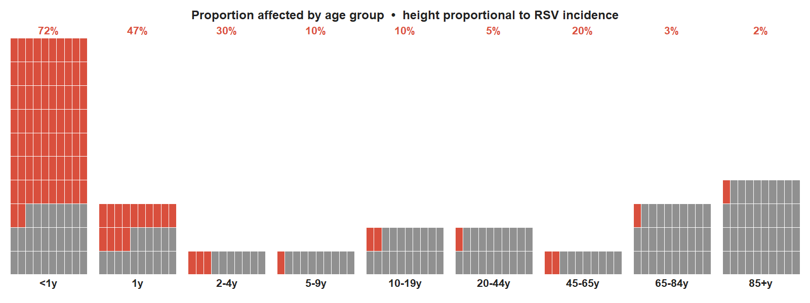
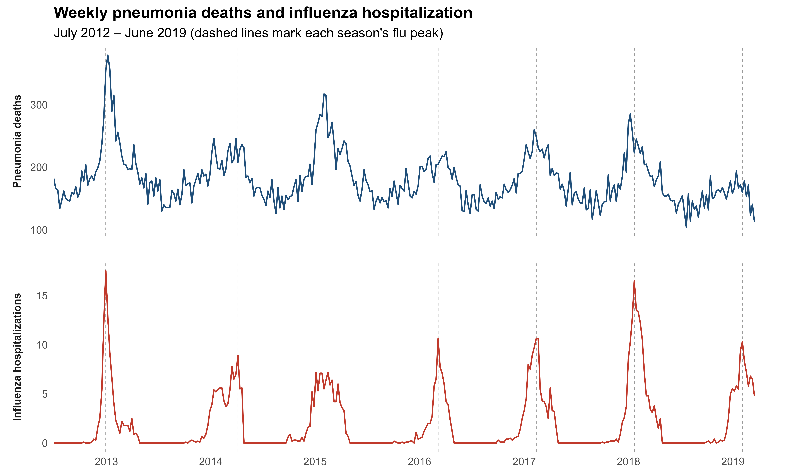

```{r setup}
#| echo: false
library(tidyverse)
library(scales)

set.seed(2024)

pal <- c(
  baseline = "#8B9DB5",
  flu      = "#E55C30",
  rsv      = "#27AE60"
)

theme_ts <- function(...) {
  theme_minimal(base_size = 12) +
    theme(
      panel.grid.minor   = element_blank(),
      panel.grid.major.x = element_blank(),
      axis.title.x       = element_blank(),
      legend.position    = "bottom",
      legend.title       = element_blank(),
      plot.title         = element_text(face = "bold", size = 13),
      plot.subtitle      = element_text(color = "gray40", size = 10)
    ) +
    theme(...)
}
```

## Introduction

### Why do we need to estimate the burden of respiratory tract infections caused by specific pathogens?

Quantifying the burden of disease for different outcomes is a fundamental challenge in public health. However, most individuals seeking healthcare for respiratory tract infections are not tested for a specific pathogen. As a result, the number of cases of disease caused by individual pathogens captured by public health surveillance systems often represents a substantial undercount.

For respiratory syncytial virus (RSV), many children presenting to the hospital or emergency department are tested for RSV, and most cases are correctly attributed to the virus (@fig-waffle). In adults, however, testing for RSV is much less common, and fewer than 5% of cases are correctly attributed to the virus in clinical records (@fig-waffle). This underdetection has been confirmed in a number of settings and using distinct methodologies.

```{r}
#| label: fig-waffle
#| fig-cap: "The proportion of RSV hospitalizations correctly attributed to RSV in clinical records differs dramatically by age group. Children are routinely tested; adults are rarely tested, leading to severe undercounting."
#| echo: false
#| out-width: "80%"
#| fig-align: center

```

The gap between the true burden of disease and the reported burden has important consequences for public health. Decisions about prioritizing different vaccine programs or other preventive investments are often based on the burden of disease. If the burden is not correctly captured, the resulting decisions about population health will be inadequate. This is particularly important for public health decisions targeting specific outcomes, like vaccines. Accurate information on disease burden caused by specific pathogens can be used to prioritize interventions and to anticipate the impact and cost effectiveness of new vaccines.

### Approaches for estimating the burden of disease due to specific pathogens

To estimate the gap between the true burden of disease and the number of reported cases, a number of approaches have been employed. Many of these methods involve intensive laboratory testing of clinical cases. For instance, in the PERCH study, pneumonia cases and healthy controls were intensively tested for bacteria and viruses, and the comparisons between cases and controls were used to infer burden. The inclusion of controls was essential in that study to ensure that the detected viruses and bacteria were causally related to the symptoms and not incidentally detected. The CHAMPS study performs minimally invasive sampling of children who die with infections to infer the pathogen responsible for the death. Likewise a large study in the United States (US) comprehensively tested adults with pneumonia to estimate the burden of disease caused by RSV and other respiratory viruses.

These clinical studies provide essential and high-quality data on the specific pathogens that cause disease and death. However, this type of active population-based study is costly to conduct and challenging to scale over time and across many different locations. Some studies attempt to fill in the gaps in locations without high quality clinical studies by using statistical models to extrapolate the estimates to locations where data were not collected. These types of approaches are frequently used in studies of the global burden of diseases.

Statistical models can also be used to more directly estimate the burden of disease caused by specific pathogens in locations with comprehensive administrative data, like from hospitals or vital statistics. These analyses evaluate how variations in a non-specific outcome, like all-cause pneumonia, correlate with variations in specific pathogens, like influenza or RSV. These analyses assume that the true burden of disease caused by specific pathogens can be recovered by studying the similarities in the trends between these signals and estimating the association between them. This methodology has been used extensively for influenza. For example, spikes in pneumonia or cardiovascular outcomes coincide with influenza activity, and statistical models can be used to estimate how much of the increase above a seasonal baseline could be attributed to influenza.

### Comparability of time series estimates with estimates from active clinical testing

A key question with any statistical method is whether it produces accurate estimates. We can assess this by comparing estimates of burden obtained from statistical models with estimates of burden from intensive sampling. For example, we previously used time series models to estimate the burden of respiratory hospitalizations in New York state that could be attributed to RSV. Among adults aged 65+ years, we estimated XX cases/100,000. An intensive clinical study, conducted in several populations in the same state, where they tested all pneumonia patients for RSV, estimated an incidence of XX cases/100,000.

In this article, we will discuss how statistical models can be used to estimate the burden of disease caused by specific viral pathogens by coupling pathogen-specific data with data on non-specific outcomes like pneumonia. We will build up a non-technical intuition for how these analyses work, discuss things to look for when evaluating these types of studies, and consider the validity of these estimates in relation to traditional clinic-based estimates. The goal of this article is to provide clinical and policy experts with a working understanding of some of the commonly used statistical models for estimating the burden of disease caused by specific pathogens.

---

## Breaking a Time Series into Pieces

Let's imagine that we know the number of hospitalizations due to pneumonia in each week in a specific population (e.g., region, age group, socioeconomic group). Looking across multiple years, we typically observe some repeating patterns, with increases in hospitalization in the winter months, and occasional short-term spikes and dips above and below the typical seasonal trends due to variations in the circulation of specific pathogens.

The importance of different pathogens in contributing to these patterns can differ over time. For instance, at the height of winter, more of the cases will be due to influenza or RSV. For instance in a severe flu season, we would expect to see a spike in pneumonia deaths that occurs around the same time as a spike in influenza positive tests. This can be seen in @fig-pneumonia-flu, where weekly pneumonia deaths in the US (upper plot) have broad seasonal variations, and more pronounced spikes above this that line up with the flu spikes shown in the lower plot.

```{r}
#| label: fig-pneumonia-flu
#| fig-cap: "Weekly pneumonia deaths (top) and influenza activity (bottom) in the US. The spikes in pneumonia deaths track closely with peaks in influenza activity."
#| echo: false
#| out-width: "90%"
#| fig-align: center

```

### A simulated worked example

In our example, we will use a simulated time series of pneumonia hospitalizations. This time series is made up of:

- An **underlying seasonal baseline**, driven by meteorological factors, social contact patterns, and other pathogens that vary seasonally
- **Increases related to influenza**, with year-to-year variation in timing and intensity
- **Increases related to RSV**, with a biennial pattern (higher activity in alternating years)
- **Unexplained short-term variation** that is autocorrelated — when there is one week with unusually high activity, the next week is also likely to be unusually high

When these components are added together, we get the full time series shown in @fig-raw-data below.

```{r simulate-data}
#| echo: false
n2     <- 522
dates2 <- seq(as.Date("2010-01-03"), by = "week", length.out = n2)
t2     <- seq_len(n2)
wk2    <- as.integer(format(dates2, "%U"))

flu_season_yr <- as.integer(format(dates2, "%Y")) +
                 ifelse(as.integer(format(dates2, "%m")) >= 7L, 1L, 0L)
seasons   <- sort(unique(flu_season_yr))
n_seasons <- length(seasons)

peak_offsets <- round(rnorm(n_seasons, 0, 2.5))
amplitudes   <- exp(rnorm(n_seasons, 0, 0.45))

flu2 <- numeric(n2)
for (i in seq_along(seasons)) {
  idx  <- which(flu_season_yr == seasons[i])
  pw   <- 2L + peak_offsets[i]
  flu2[idx] <- pmax(0, cos(2 * pi * (wk2[idx] - pw) / 52))^5 *
               90 * amplitudes[i]
}
flu2 <- pmax(0, flu2 + rnorm(n2, 0, 4))

rsv_year    <- as.integer(format(dates2, "%Y"))
biennl_mult <- ifelse(rsv_year %% 2 == 0, 1.40, 0.65)
rsv2 <- pmax(0,
  pmax(0, cos(2 * pi * (wk2 - 47) / 52))^2.5 * 55 * biennl_mult + rnorm(n2, 0, 3)
)

flu2_s <- flu2 / max(flu2)
rsv2_s <- rsv2 / max(rsv2)

sin1_2 <- sin(2 * pi * t2 / 52);  cos1_2 <- cos(2 * pi * t2 / 52)
sin2_2 <- sin(4 * pi * t2 / 52);  cos2_2 <- cos(4 * pi * t2 / 52)

int2   <- 200
b3_rsv <- 30
b4_flu <- 80

mu2 <- (int2 +
          12 * sin1_2 - 8 * cos1_2 +
           4 * sin2_2 + 2 * cos2_2 +
          b3_rsv * rsv2_s + b4_flu * flu2_s)
mu2 <- pmax(1, mu2)

pneu2 <- rnbinom(n2, mu = mu2, size = 40)

df2 <- tibble(
  date  = dates2,
  t     = t2,
  pneu  = pneu2,
  flu   = flu2, rsv = rsv2,
  flu_s = flu2_s, rsv_s = rsv2_s,
  sin1  = sin1_2, cos1 = cos1_2,
  sin2  = sin2_2, cos2 = cos2_2
)

winters2 <- tibble(
  xmin = as.Date(paste0(2009:2018, "-12-01")),
  xmax = as.Date(c(paste0(2010:2018, "-02-28"), "2019-02-28"))
)
```

```{r}
#| label: fig-raw-data
#| fig-cap: "Simulated weekly time series for each variable, 2010–2019. Blue bands mark winter months (December–February), when respiratory viruses tend to peak."
#| fig-height: 7

df_long1 <- df2 |>
  select(date, pneu, flu, rsv) |>
  pivot_longer(-date, names_to = "series", values_to = "value") |>
  mutate(
    panel = factor(series,
      levels = c("pneu", "flu", "rsv"),
      labels = c(
        "Pneumonia Hospitalizations (weekly count)",
        "Influenza Activity (index, 0–100)",
        "RSV Activity (index, 0–100)"
      )
    ),
    color = case_match(series,
      "pneu" ~ "black",
      "flu"  ~ unname(pal["flu"]),
      "rsv"  ~ unname(pal["rsv"])
    )
  )

ggplot(df_long1, aes(date, value)) +
  geom_rect(
    data        = winters2,
    aes(xmin = xmin, xmax = xmax, ymin = -Inf, ymax = Inf),
    inherit.aes = FALSE,
    fill        = "steelblue", alpha = 0.09
  ) +
  geom_line(aes(color = color, group = 1), linewidth = 0.65, show.legend = FALSE) +
  facet_wrap(~panel, scales = "free_y", ncol = 1) +
  scale_color_identity() +
  scale_x_date(date_breaks = "1 year", date_labels = "%Y") +
  labs(y = NULL) +
  theme_ts(
    panel.grid.major.x = element_line(color = "gray90"),
    strip.text         = element_text(face = "bold", size = 11)
  )
```

---

## The Regression Model

The goal for statistical models used for burden estimation is to take the pneumonia time series and estimate the size of each component. This is typically done in a regression framework.

In the regression, the **outcome variable** ($Y$) is the number of pneumonia cases or deaths in each week. **Covariates** ($X$) include an indicator of influenza activity, a trend for time, and a variable that captures seasonal variations. This can be written generically as:

$$
\text{Expected pneumonia cases} = \underbrace{b_0}_{\text{intercept}} + \underbrace{b_1 \times \text{Influenza activity}}_{\text{flu contribution}} + \underbrace{b_2 \times \text{Seasonality}}_{\text{seasonal baseline}} + \text{Unexplained variation}
$$

The regression model estimates the intercept ($b_0$), which gives the average number of cases, and the relative contributions of influenza and seasonality ($b_1$ and $b_2$). $b_1$ acts as a multiplier that bridges the influenza activity indicator to the pneumonia time series and is the key part of the model that estimates how much pneumonia increases when influenza increases. The seasonality component ($b_2$) is important to include as well. By including both seasonality and the influenza indicator in the model, we can more accurately estimate how much of the variability in pneumonia rates is due to influenza and how much is due to unexplained seasonal variation. **If the seasonal term is omitted from the model, then all of the seasonal variation would be attributed to influenza — $b_1$ would be too large.**

```{r fit-model}
#| echo: false
fit <- glm(
  pneu ~ sin1 + cos1 + sin2 + cos2 + flu_s + rsv_s,
  data   = df2,
  family = poisson(link = "log")
)

pred <- predict(fit, se.fit = TRUE)
df2 <- df2 |>
  mutate(
    fitted    = exp(pred$fit),
    fit_lo    = exp(pred$fit - 1.96 * pred$se.fit),
    fit_hi    = exp(pred$fit + 1.96 * pred$se.fit)
  )

b <- coef(fit)

lp_base     <- b["(Intercept)"]
lp_seasonal <- b["sin1"]*df2$sin1 + b["cos1"]*df2$cos1 +
               b["sin2"]*df2$sin2 + b["cos2"]*df2$cos2
lp_rsv      <- b["rsv_s"] * df2$rsv_s

mu_none <- exp(lp_base + lp_seasonal)
mu_rsv  <- exp(lp_base + lp_seasonal + lp_rsv)
mu_full <- df2$fitted

df2 <- df2 |>
  mutate(
    comp_baseline = mu_none,
    comp_rsv      = pmax(0, mu_rsv  - mu_none),
    comp_flu      = pmax(0, mu_full - mu_rsv)
  )
```

### Using the model to calculate attributable burden

Once we have fit the regression above, we will have an estimate for $b_0$, $b_1$, and $b_2$ and can then use the completed equation to calculate the percent of pneumonia burden that is caused by influenza. The overall equation that captures the weekly number of expected cases is:

$$
\hat{Y} = b_0 + b_1 \times \text{Influenza} + b_2 \times \text{Seasonality}
$$

We can simply take this equation and **set the flu term to zero**. This is called a *counterfactual* and represents how many pneumonia cases we would expect if influenza had not been there:

$$
\hat{Y}_0 = b_0 + 0 + b_2 \times \text{Seasonality}
$$

We can plot the predicted value and the counterfactual value, and the **area between these curves** represents the expected contribution from influenza. We can sum the modeled values over multiple time points and repeat the calculation on aggregated values, which we can use to estimate the overall attributable percent by season or across all seasons.

---

## Decomposing the Signal

@fig-decomp shows the full decomposition of the model fit. The stacked areas represent the three model components (seasonal baseline, RSV contribution, influenza contribution), and the total height of the stack equals the model's fitted value at every time point. Observed counts are overlaid as points.

```{r}
#| label: fig-decomp
#| fig-cap: "Stacked area chart showing the contribution of each model component to weekly expected hospitalizations. The total height of the stack matches the model's fitted values at every time point. Observed counts are overlaid as black points."

decomp_long <- df2 |>
  select(date, pneu, comp_baseline, comp_rsv, comp_flu) |>
  pivot_longer(
    cols      = starts_with("comp_"),
    names_to  = "component",
    values_to = "value"
  ) |>
  mutate(component = factor(component,
    levels = c("comp_baseline", "comp_rsv", "comp_flu"),
    labels = c("Seasonal Baseline", "RSV", "Influenza")
  ))

comp_colors <- c(
  "Seasonal Baseline" = unname(pal["baseline"]),
  "RSV"               = unname(pal["rsv"]),
  "Influenza"         = unname(pal["flu"])
)

ggplot(decomp_long, aes(date, value, fill = component)) +
  geom_area(position = "stack", alpha = 0.88, color = NA) +
  geom_point(
    data        = df2,
    aes(x = date, y = pneu),
    inherit.aes = FALSE,
    color       = "black", size = 0.75, alpha = 0.50
  ) +
  scale_fill_manual(values = comp_colors) +
  scale_x_date(date_breaks = "1 year", date_labels = "%Y") +
  scale_y_continuous(labels = comma_format()) +
  labs(y = "Expected hospitalizations / week", fill = NULL) +
  theme_ts() +
  guides(fill = guide_legend(nrow = 1, reverse = TRUE))
```

---

## Attributable Burden Summary

@fig-burden shows the estimated total hospitalizations attributable to each respiratory virus over the full 10-year period, expressed as the excess above the seasonal baseline.

```{r}
#| label: fig-burden
#| fig-cap: "Estimated hospitalizations attributable to each respiratory virus over the full 10-year pre-pandemic period (excess above the seasonal baseline). Percentages are of total modeled hospitalizations."
#| fig-height: 3.8

virus_totals <- tibble(
  Component = c("Influenza", "RSV"),
  Total     = c(sum(df2$comp_flu), sum(df2$comp_rsv)),
  Color     = c(pal["flu"], pal["rsv"])
) |>
  mutate(
    pct_total = Total / sum(df2$fitted) * 100,
    bar_label = sprintf(
      "%s hospitalizations\n(%.1f%% of total)",
      comma(round(Total)),
      pct_total
    ),
    Component = fct_reorder(Component, Total)
  )

ggplot(virus_totals, aes(x = Component, y = Total, fill = Color)) +
  geom_col(width = 0.5, show.legend = FALSE) +
  geom_text(
    aes(label = bar_label),
    hjust  = -0.05,
    size   = 3.8,
    fontface = "bold",
    color  = "gray20"
  ) +
  coord_flip(clip = "off") +
  scale_fill_identity() +
  scale_y_continuous(
    labels = comma_format(),
    expand = expansion(mult = c(0, 0.55))
  ) +
  labs(
    x = NULL,
    y = "Estimated attributable hospitalizations (10-year total)"
  ) +
  theme_ts(
    panel.grid.major.y = element_blank(),
    panel.grid.major.x = element_line(color = "gray88"),
    axis.text.y        = element_text(size = 12, face = "bold"),
    plot.margin        = margin(10, 120, 10, 10)
  )
```

---

## Technical Considerations

### Distinguishing the contribution of a virus from seasonal variation

With influenza, the intensity and timing of the epidemic varies considerably year-to-year. Therefore, it is typically straightforward to disentangle the effect of influenza from seasonal variations that are not caused by influenza. Some other pathogens show less year-to-year variability in epidemic timing or intensity, making it more challenging to accurately estimate the effect of the virus. This can sometimes be seen during the model fitting process as having either seasonal factors or viral terms that are unstable or have high levels of uncertainty. In these situations, it can sometimes be helpful to simultaneously model data from multiple regions or age groups that might have different seasonal patterns. It can also be helpful to explore lags between the virus and the pneumonia time series and to explore different ways to capture the consistent seasonal variations (e.g., harmonics vs penalized splines).

### Dealing with changes in diagnostics

Attribution models typically assume that the association between the viral indicator and pneumonia is stable over time. However, for many viruses, the use of laboratory diagnostics changed dramatically in the period after the COVID-19 pandemic. Ignoring this change will likely lead to under-estimation of the contribution of the virus. If data on viral testing volumes over time are available, this can be used to detrend the data. A possible solution is to take a 12-month moving average of viral testing volumes and use this to adjust the number of positive tests. This avoids inappropriately removing some of the seasonal variation while still adjusting for the long-term trends. If testing data are not available, other approaches to detrending the data could be considered, like fitting a linear trend through the data and adjusting by the trend.

### Time resolution

Ideally, these types of analyses should be conducted using **weekly data**. This allows the model to leverage maximum levels of variability in viral activity. It is often possible to conduct robust analyses with monthly data, though it is sometimes more difficult to disentangle the effects of the virus from seasonal variation with monthly data. Quarterly data will not be sufficient for analysis in most settings, with the exception of extreme events like the emergence of a pandemic virus.

### Additive vs. multiplicative models

In the example above, a linear regression is used to estimate the contribution of each component, and the components are added together to get the expected number of pneumonia cases. In many studies, a Poisson or a negative binomial regression is used instead. While these models are often most appropriate for modeling disease count data or incidence data, the components are added together on the scale of $\log(\text{cases})$ rather than on the original scale of the pneumonia cases. This can influence the interpretation of the regression coefficients and affects how the terms interact with each other. For instance if there is a strong trend in the pneumonia data, the effect of the trend is multiplied by the effect of RSV rather than added to it. Depending on the specific data, this could be appropriate, or it could introduce bias.

A compromise solution is to use an **additive Poisson** or **additive negative binomial** model. With this approach, the terms are added together as they are in a linear regression, but the model takes into account that the outcome variable is a discrete count. Fitting this type of model is technically more complicated and requires specialized software (e.g., JAGS).

#### Link function comparison: log vs. identity

The figures below illustrate how the choice of link function affects burden estimation. The analysis is run under two scenarios:

1. **Additive (identity-link) DGP** — the identity-link Poisson model is correctly specified; the log-link model is misspecified.
2. **Multiplicative (log-link) DGP** — the Poisson log-link model is correctly specified; the identity-link model is misspecified.

In each case, the true burden from the data-generating process is shown as a dashed reference line.

::: {.panel-tabset}

#### Additive DGP

```{r link-comparison}
fit_log <- fit

fit_id <- glm(
  pneu ~ sin1 + cos1 + sin2 + cos2 + flu_s + rsv_s,
  data    = df2,
  family  = poisson(link = "identity"),
  start   = coef(fit_log) |> (\(b) c(exp(b[1]), b[-1]))()
)

pred_log_se <- predict(fit_log, se.fit = TRUE)
pred_id_se  <- predict(fit_id,  se.fit = TRUE)

df_compare <- df2 |>
  select(date, pneu) |>
  mutate(
    log_fit = fitted(fit_log),
    log_lo  = exp(pred_log_se$fit - 1.96 * pred_log_se$se.fit),
    log_hi  = exp(pred_log_se$fit + 1.96 * pred_log_se$se.fit),
    id_fit  = fitted(fit_id),
    id_lo   = pmax(0, pred_id_se$fit - 1.96 * pred_id_se$se.fit),
    id_hi   = pred_id_se$fit + 1.96 * pred_id_se$se.fit
  )

ggplot(df_compare, aes(x = date)) +
  geom_ribbon(aes(ymin = log_lo, ymax = log_hi), fill = "#2166ac", alpha = 0.15) +
  geom_ribbon(aes(ymin = id_lo,  ymax = id_hi),  fill = "#d6604d", alpha = 0.15) +
  geom_line(aes(y = log_fit, color = "Poisson (log)"),      linewidth = 0.7) +
  geom_line(aes(y = id_fit,  color = "Poisson (identity)"), linewidth = 0.7, linetype = "dashed") +
  geom_point(aes(y = pneu), color = "black", size = 0.6, alpha = 0.45) +
  scale_color_manual(values = c("Poisson (log)" = "#2166ac", "Poisson (identity)" = "#d6604d")) +
  scale_x_date(date_breaks = "1 year", date_labels = "%Y") +
  scale_y_continuous(labels = comma_format()) +
  labs(
    y        = "Weekly hospitalizations",
    color    = NULL,
    subtitle = "Additive DGP: identity-link model is correctly specified. Shaded bands = 95% CI."
  ) +
  theme_ts(legend.position = "top")
```

```{r burden-comparison}
b_id <- coef(fit_id)

id_comp_rsv <- pmax(0, b_id["rsv_s"] * df2$rsv_s)
id_comp_flu <- pmax(0, b_id["flu_s"] * df2$flu_s)

true_burden <- tibble(
  Pathogen   = c("RSV", "Influenza"),
  TrueBurden = c(sum(b3_rsv * df2$rsv_s), sum(b4_flu * df2$flu_s))
)

burden <- bind_rows(
  tibble(
    Link      = "Poisson (log)",
    Pathogen  = c("RSV", "Influenza"),
    Burden    = c(sum(df2$comp_rsv), sum(df2$comp_flu)),
    Total_fit = sum(df2$fitted)
  ),
  tibble(
    Link      = "Poisson (identity)",
    Pathogen  = c("RSV", "Influenza"),
    Burden    = c(sum(id_comp_rsv), sum(id_comp_flu)),
    Total_fit = sum(fitted(fit_id))
  )
) |>
  mutate(Pct = Burden / Total_fit * 100)

knitr::kable(
  burden |> select(Link, Pathogen, Burden, Pct),
  digits    = c(0, 0, 0, 1),
  caption   = "Additive DGP — 10-year attributable burden by link function",
  col.names = c("Link", "Pathogen", "Attributable hospitalizations", "% of total fitted")
)
```

```{r burden-comparison-plot}
#| fig-cap: "Additive DGP: attributable burden by link function. Dashed line = true value from the data-generating process. The correctly-specified identity-link model should recover the true burden more accurately."
#| fig-height: 3.5

burden_plot <- burden |>
  mutate(bar_label = sprintf("%s  (%.1f%%)", comma(round(Burden)), Pct))

ggplot(burden_plot, aes(x = Pathogen, y = Burden, fill = Link)) +
  geom_col(position = position_dodge(width = 0.6), width = 0.5) +
  geom_text(
    aes(label = bar_label),
    position = position_dodge(width = 0.6),
    vjust = -0.4, size = 3.2, fontface = "bold", color = "gray20"
  ) +
  geom_crossbar(
    data        = true_burden,
    aes(x = Pathogen, y = TrueBurden, ymin = TrueBurden, ymax = TrueBurden),
    inherit.aes = FALSE,
    width = 0.65, color = "black", linewidth = 0.7, linetype = "dashed", fatten = 0
  ) +
  scale_fill_manual(values = c("Poisson (log)" = "#2166ac", "Poisson (identity)" = "#d6604d")) +
  scale_y_continuous(labels = comma_format(), expand = expansion(mult = c(0, 0.18))) +
  labs(
    x = NULL, y = "Attributable hospitalizations (10-year total)", fill = NULL,
    subtitle = "Dashed line = true value from data-generating process"
  ) +
  theme_ts(legend.position = "top")
```

#### Multiplicative DGP

```{r mult-simulate}
#| echo: false
int2_m   <- log(200)
b3_rsv_m <- 0.15
b4_flu_m <- 0.40

mu2_m <- exp(
  int2_m +
  12 * sin1_2 - 8 * cos1_2 +
   4 * sin2_2 + 2 * cos2_2 +
  b3_rsv_m * rsv2_s + b4_flu_m * flu2_s
)

pneu2_m <- rnbinom(n2, mu = mu2_m, size = 40)

df2_m <- tibble(
  date  = dates2, t = t2,
  pneu  = pneu2_m,
  flu_s = flu2_s, rsv_s = rsv2_s,
  sin1  = sin1_2, cos1 = cos1_2,
  sin2  = sin2_2, cos2 = cos2_2
)
```

```{r mult-fit}
fit_log_m <- glm(
  pneu ~ sin1 + cos1 + sin2 + cos2 + flu_s + rsv_s,
  data   = df2_m,
  family = poisson(link = "log")
)

fit_id_m <- glm(
  pneu ~ sin1 + cos1 + sin2 + cos2 + flu_s + rsv_s,
  data   = df2_m,
  family = poisson(link = "identity"),
  start  = coef(fit_log_m) |> (\(b) c(exp(b[1]), b[-1]))()
)

gof_m <- tibble(
  Link     = c("log", "identity"),
  AIC      = c(AIC(fit_log_m), AIC(fit_id_m)),
  Deviance = c(deviance(fit_log_m), deviance(fit_id_m)),
  Null_Dev = c(fit_log_m$null.deviance, fit_id_m$null.deviance)
) |>
  mutate(
    Pseudo_R2 = 1 - Deviance / Null_Dev,
    RMSE      = c(
      sqrt(mean((df2_m$pneu - fitted(fit_log_m))^2)),
      sqrt(mean((df2_m$pneu - fitted(fit_id_m))^2))
    )
  ) |>
  select(Link, AIC, Deviance, Pseudo_R2, RMSE)

knitr::kable(
  gof_m,
  digits    = c(0, 1, 1, 4, 2),
  caption   = "Multiplicative DGP — Poisson log vs identity link",
  col.names = c("Link", "AIC", "Residual Deviance", "Pseudo R²", "RMSE")
)
```

```{r mult-fit-plot}
#| fig-cap: "Multiplicative DGP: observed weekly counts vs fitted values. Under a multiplicative DGP the log-link model (blue) is correctly specified."

pred_log_m <- predict(fit_log_m, se.fit = TRUE)
pred_id_m  <- predict(fit_id_m,  se.fit = TRUE)

df_compare_m <- df2_m |>
  select(date, pneu) |>
  mutate(
    log_fit = fitted(fit_log_m),
    log_lo  = exp(pred_log_m$fit - 1.96 * pred_log_m$se.fit),
    log_hi  = exp(pred_log_m$fit + 1.96 * pred_log_m$se.fit),
    id_fit  = fitted(fit_id_m),
    id_lo   = pmax(0, pred_id_m$fit - 1.96 * pred_id_m$se.fit),
    id_hi   = pred_id_m$fit + 1.96 * pred_id_m$se.fit
  )

ggplot(df_compare_m, aes(x = date)) +
  geom_ribbon(aes(ymin = log_lo, ymax = log_hi), fill = "#2166ac", alpha = 0.15) +
  geom_ribbon(aes(ymin = id_lo,  ymax = id_hi),  fill = "#d6604d", alpha = 0.15) +
  geom_line(aes(y = log_fit, color = "Poisson (log)"),      linewidth = 0.7) +
  geom_line(aes(y = id_fit,  color = "Poisson (identity)"), linewidth = 0.7, linetype = "dashed") +
  geom_point(aes(y = pneu), color = "black", size = 0.6, alpha = 0.45) +
  scale_color_manual(values = c("Poisson (log)" = "#2166ac", "Poisson (identity)" = "#d6604d")) +
  scale_x_date(date_breaks = "1 year", date_labels = "%Y") +
  scale_y_continuous(labels = comma_format()) +
  labs(
    y        = "Weekly hospitalizations",
    color    = NULL,
    subtitle = "Multiplicative DGP: log-link model is correctly specified. Shaded bands = 95% CI."
  ) +
  theme_ts(legend.position = "top")
```

```{r mult-burden-plot}
#| fig-cap: "Multiplicative DGP: attributable burden by link function. Under a multiplicative DGP the log-link model should recover the true burden more accurately."
#| fig-height: 3.5

b_log_m       <- coef(fit_log_m)
lp_base_m     <- b_log_m["(Intercept)"]
lp_seasonal_m <- b_log_m["sin1"]*df2_m$sin1 + b_log_m["cos1"]*df2_m$cos1 +
                 b_log_m["sin2"]*df2_m$sin2 + b_log_m["cos2"]*df2_m$cos2

mu_none_log_m <- exp(lp_base_m + lp_seasonal_m)
mu_rsv_log_m  <- exp(lp_base_m + lp_seasonal_m + b_log_m["rsv_s"] * df2_m$rsv_s)
mu_full_log_m <- fitted(fit_log_m)

log_m_comp_rsv <- pmax(0, mu_rsv_log_m  - mu_none_log_m)
log_m_comp_flu <- pmax(0, mu_full_log_m - mu_rsv_log_m)

b_id_m        <- coef(fit_id_m)
id_m_comp_rsv <- pmax(0, b_id_m["rsv_s"] * df2_m$rsv_s)
id_m_comp_flu <- pmax(0, b_id_m["flu_s"] * df2_m$flu_s)

lp_seas_true_m <- 12*df2_m$sin1 - 8*df2_m$cos1 + 4*df2_m$sin2 + 2*df2_m$cos2
mu_none_true_m <- exp(int2_m + lp_seas_true_m)
mu_rsv_true_m  <- exp(int2_m + lp_seas_true_m + b3_rsv_m * df2_m$rsv_s)
mu_full_true_m <- exp(int2_m + lp_seas_true_m + b3_rsv_m * df2_m$rsv_s + b4_flu_m * df2_m$flu_s)

true_burden_m <- tibble(
  Pathogen   = c("RSV", "Influenza"),
  TrueBurden = c(sum(mu_rsv_true_m - mu_none_true_m), sum(mu_full_true_m - mu_rsv_true_m))
)

burden_m <- bind_rows(
  tibble(
    Link      = "Poisson (log)",
    Pathogen  = c("RSV", "Influenza"),
    Burden    = c(sum(log_m_comp_rsv), sum(log_m_comp_flu)),
    Total_fit = sum(fitted(fit_log_m))
  ),
  tibble(
    Link      = "Poisson (identity)",
    Pathogen  = c("RSV", "Influenza"),
    Burden    = c(sum(id_m_comp_rsv), sum(id_m_comp_flu)),
    Total_fit = sum(fitted(fit_id_m))
  )
) |>
  mutate(
    Pct       = Burden / Total_fit * 100,
    bar_label = sprintf("%s  (%.1f%%)", comma(round(Burden)), Pct)
  )

ggplot(burden_m, aes(x = Pathogen, y = Burden, fill = Link)) +
  geom_col(position = position_dodge(width = 0.6), width = 0.5) +
  geom_text(
    aes(label = bar_label),
    position = position_dodge(width = 0.6),
    vjust = -0.4, size = 3.2, fontface = "bold", color = "gray20"
  ) +
  geom_crossbar(
    data        = true_burden_m,
    aes(x = Pathogen, y = TrueBurden, ymin = TrueBurden, ymax = TrueBurden),
    inherit.aes = FALSE,
    width = 0.65, color = "black", linewidth = 0.7, linetype = "dashed", fatten = 0
  ) +
  scale_fill_manual(values = c("Poisson (log)" = "#2166ac", "Poisson (identity)" = "#d6604d")) +
  scale_y_continuous(labels = comma_format(), expand = expansion(mult = c(0, 0.18))) +
  labs(
    x = NULL, y = "Attributable hospitalizations (10-year total)", fill = NULL,
    subtitle = "Dashed line = true value from data-generating process"
  ) +
  theme_ts(legend.position = "top")
```

:::

### Reporting results

The goal for attribution studies is typically to estimate the **contribution** of a virus to the burden of pneumonia, not to test whether there is an association between the virus and pneumonia. As a result, results should cite estimates of attributable percent and attributable incidence with measures of uncertainty (e.g., 95% confidence intervals) but should not rely on P-values for making a determination of an association.

### Autocorrelation

Many attribution models ignore residual autocorrelation. Often after accounting for seasonality, viral activity, and trends, there is little residual autocorrelation in the data. It is sometimes desirable to explicitly capture autocorrelation in the model to ensure the estimates appropriately capture the uncertainty in the data. However, this should be approached cautiously, as the inclusion of autoregressive terms can sometimes lead to bias in the estimates of viral activity.

---

## Conclusions

Time series models provide a complementary method for estimating the impact of specific viruses on the burden of pneumonia or other non-specific outcomes. Because many clinical cases are not tested for specific pathogens, this type of attribution analysis can provide a more complete picture of the burden of disease caused by specific pathogens. While the highest standard of evidence comes from clinical studies that involve intensive testing, statistical approaches provide a scalable solution that can be used in many different locations. The statistical methods often provide similar estimates to the ground truth clinical data when it is available for comparison.
